# Desafio Vertical TI - CRUD de Categorias

Este repositório contém a solução para o desafio técnico da Vertical TI. A solução consiste em um CRUD web simples para gerenciar categorias, desenvolvido ASP.NET e Vue.js.

---

## Tecnologias Utilizadas

- **Backend**: C# com ASP.NET
- **Frontend**: Vue.js
- **Banco de Dados**: PostgreSQL
- **Containerização**: Docker e Docker Compose

---

## Descrição do Projeto

- **Código**  
  - Obrigatório  
  - Deve conter apenas letras e números
  
- **Título**  
  - Obrigatório  
  - Máximo de 100 caracteres
  
- **Descrição**  
  - Obrigatório  
  - Máximo de 255 caracteres

A aplicação é composta por:
- **API RESTful** desenvolvida em C# com ASP.NET para gerenciamento das categorias.
- **Interface web** construída com Vue.js para interação do usuário, sendo estilizada a parti do BootStrap.
- **Banco de dados PostgreSQL** para armazenamento de dados.
- **Orquestração via Docker** para facilitar a comunicação entre os componentes e o deploy.

Todos os componentes se comunicam entre si utilizando Docker, garantindo um ambiente consistente e de fácil implantação.

---

## Funcionalidades

- Listar Categorias
- Criar Nova Categoria
- Atualizar Categoria
- Deletar Categoria

Além disso, a API REST opcionalmente suporta todos os métodos CRUD necessários.

---

## Pré-requisitos

- [Docker](https://docs.docker.com/get-docker/) instalado na máquina

---

## Como Rodar a Aplicação

1. Clone este repositório:
   ```bash
   git clone git@github.com:ThFabricio/desafio-vertical.git
   cd desafio-vertical
   ```

2. Execute o seguinte comando para buildar e iniciar todos os containers:
   ```bash
   docker-compose up --build
   ```

Isso iniciará os containers do backend, frontend e do banco de dados.

---

## Acesso à Interface Web

Após iniciar a aplicação, acesse a interface web pelo seguinte endereço:

[http://localhost:5173/](http://localhost:5173/)

---

## Endpoints da API REST

A API da aplicação está disponível na porta `8080`. A seguir, alguns exemplos de como utilizar os endpoints com `curl`:

### Listar Categorias

```bash
curl --location 'http://localhost:8080/api/v1/category'
```

### Obter uma Categoria Específica

```bash
curl --location 'http://localhost:8080/api/v1/category/{categoriaId}' \
--header 'id: {categoriaId}'
```
> **Nota**: Substitua `{categoriaId}` pelo ID real de uma categoria existente no banco de dados.

### Deletar uma Categoria

```bash
curl --location --request DELETE 'http://localhost:8080/api/v1/category/{categoriaId}' \
--header 'id: {categoriaId}'
```
> **Nota**: Substitua `{categoriaId}` pelo ID real de uma categoria existente no banco de dados.

### Criar uma Nova Categoria

```bash
curl --location 'http://localhost:8080/api/v1/category' \
--header 'Content-Type: application/json' \
--data '{
    "title": "teste9",
    "description": "teste2",
    "code": "112sab"
}'
```

### Atualizar uma Categoria

```bash
curl --location --request PUT 'http://localhost:8080/api/v1/category/{categoriaId}' \
--header 'id: {categoriaId}' \
--header 'Content-Type: application/json' \
--data '{
    "title": "teste2",
    "description": "teste2",
    "code": "112sa"
}'
```
> **Nota**: Substitua `{categoriaId}` pelo ID real de uma categoria existente no banco de dados.

---

---

## Prints das Telas

### Tela Inicial - Lista de Categorias
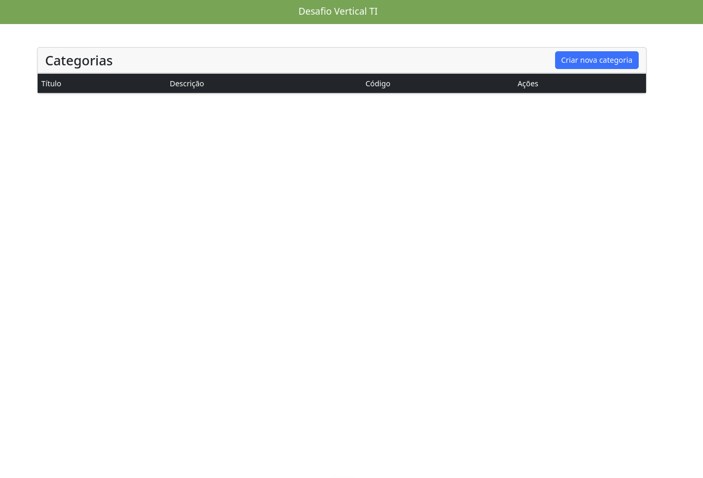

> Exibição inicial com a lista de categorias cadastradas.

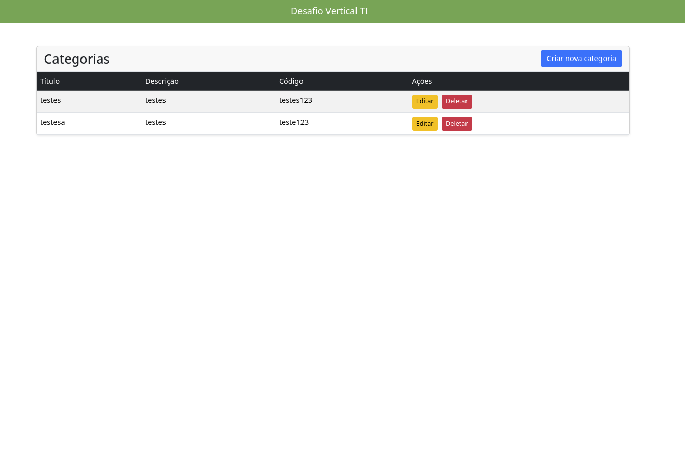

> Exibição da segunda página da lista de categorias.

---

### Criar Nova Categoria
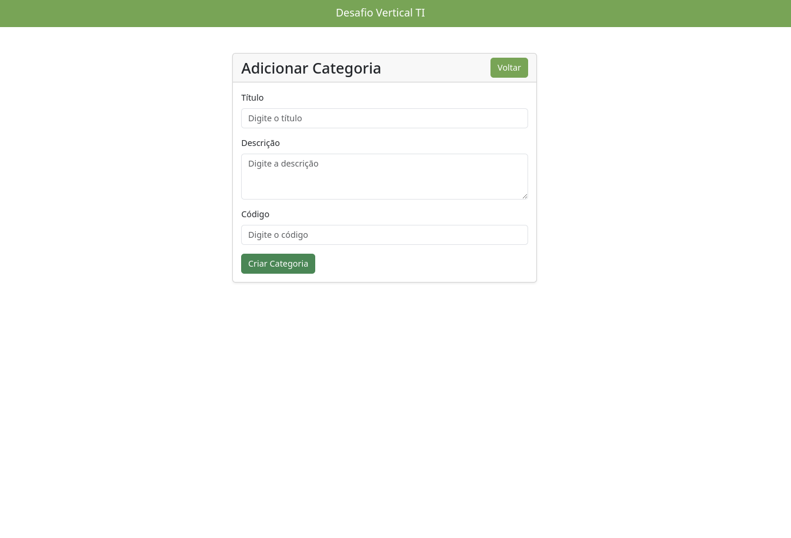

> Formulário para criação de uma nova categoria.

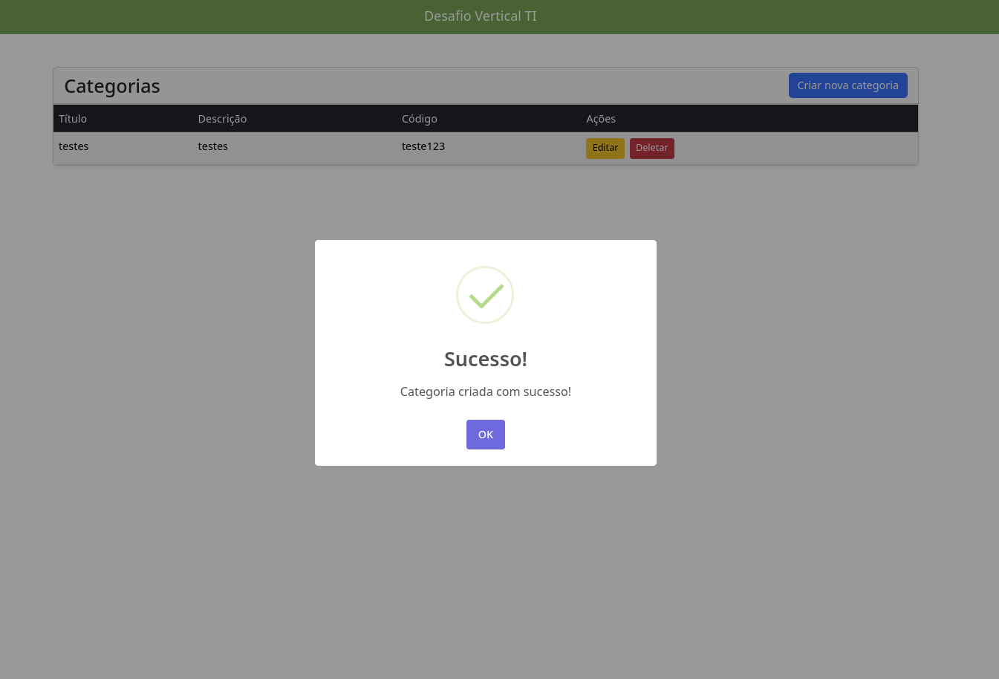

> Mensagem de sucesso após a criação de uma nova categoria.

---

### Editar Categoria
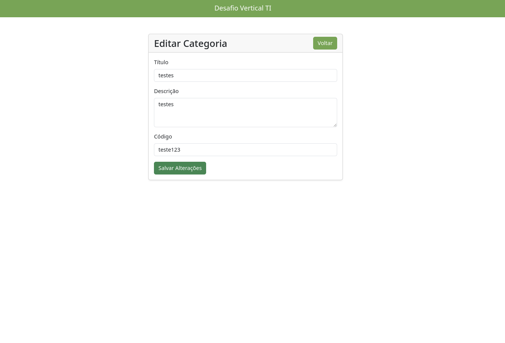

> Formulário para edição de uma categoria existente.

---

### Deletar Categoria
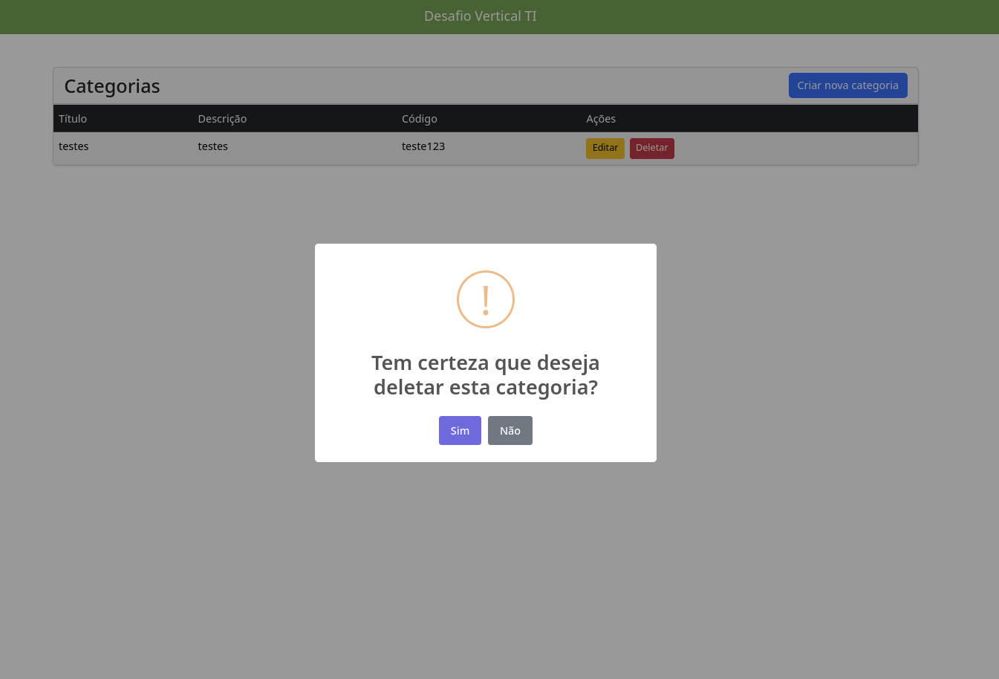

> Tela de confirmação para exclusão de uma categoria.

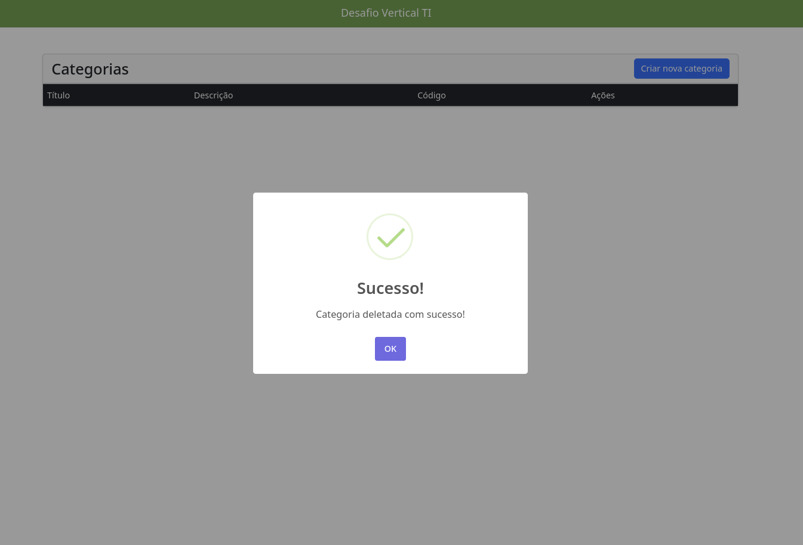

> Mensagem indicando que a categoria foi excluída com sucesso.

---

### Validação de Campos
#### Código
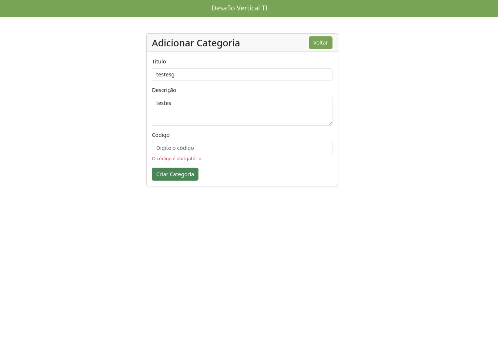

> Mensagem de erro ao inserir um código inválido.

#### Título
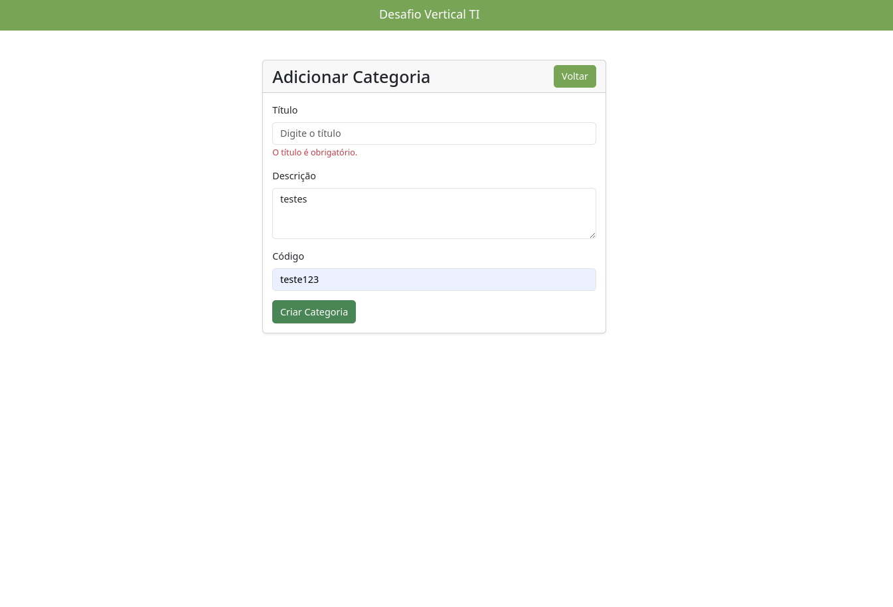

> Mensagem de erro ao inserir um título inválido.

#### Descrição
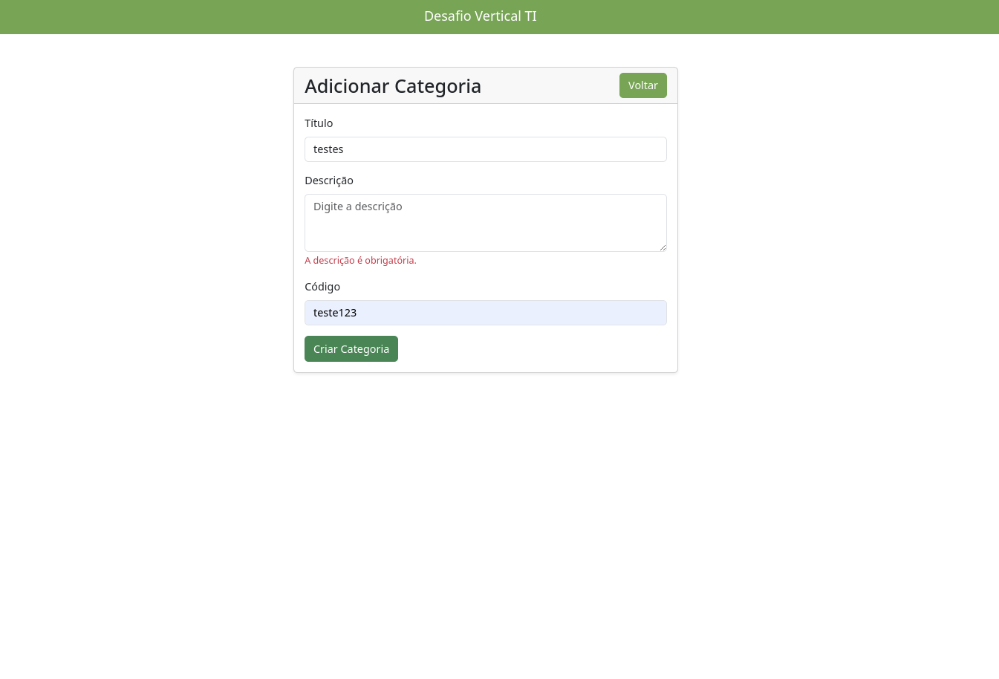

> Mensagem de erro ao inserir uma descrição inválida.

---

### Erros de Utilização
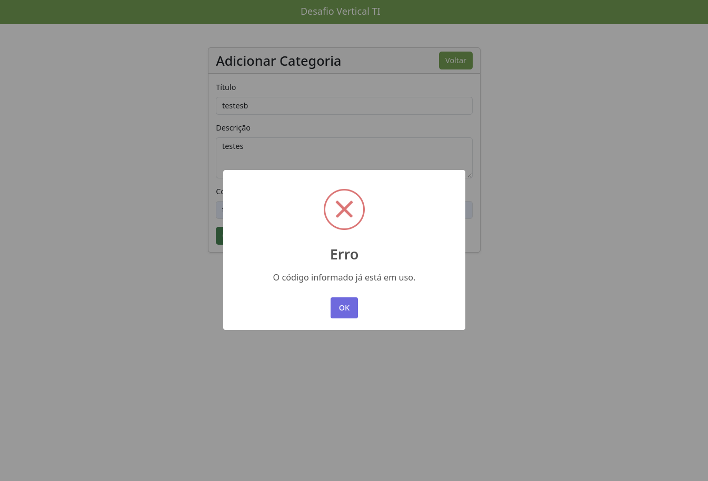

> Mensagem de erro ao tentar cadastrar um código já existente.

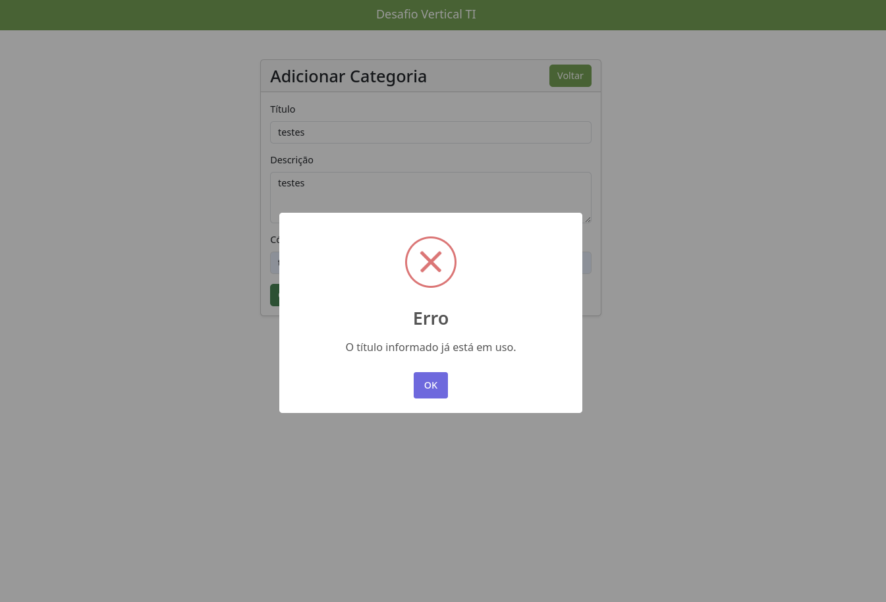

> Mensagem de erro ao tentar cadastrar um título já existente.

---

**Projeto desenvolvido para o desafio técnico da Vertical TI.**